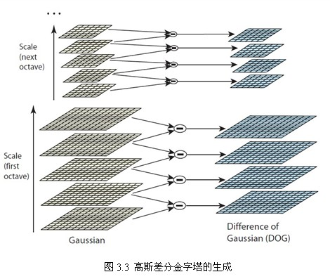
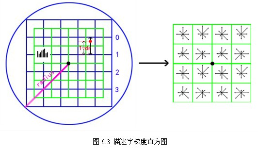
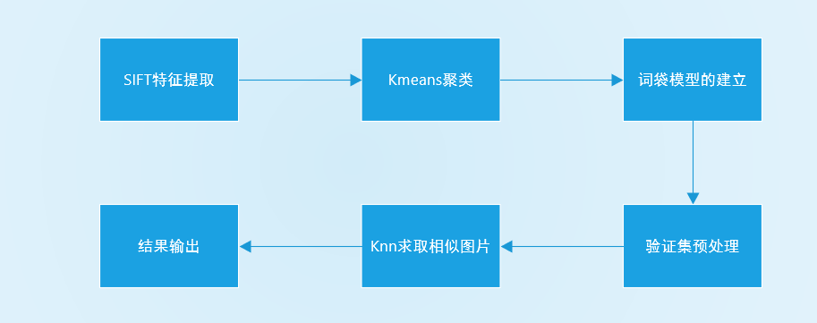
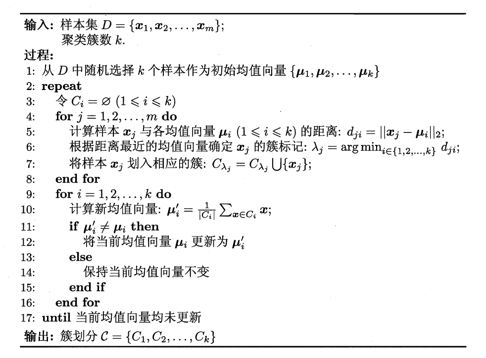
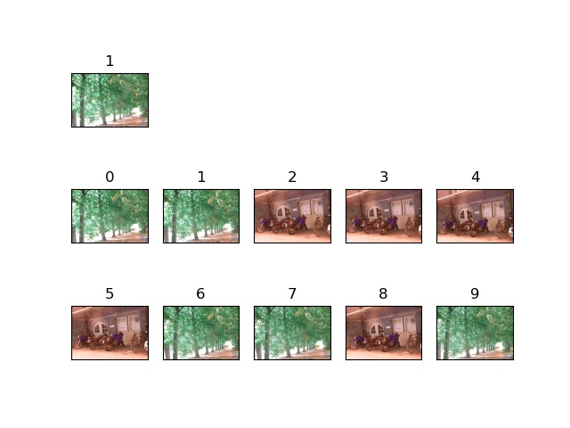

# SFIT特征抽取代码实现

## SFIT简介

>   尺度不变特征转换(Scale-invariant feature
>   transform或SIFT)是把图像的特征以关键点的位置，方向以及特征向量表示。SIFT特征是图像的局部特征，其对旋转、尺度缩放、亮度变化保持不变性，对视角变化、仿射变换、噪声也保持一定程度的稳定性，sift特征具有高速性，经优化的SIFT匹配算法甚至可以达到实时的要求。SIFT引出了尺度空间的概念，尺度即进行高斯模糊的半径。通过不同尺度的高斯模糊掩盖了光照，仿射变换和噪音等因素而变化的点。以下将介绍SIFT代码实现的具体步骤。

## SFIT实现

>   Step1.首先进行降采样，将图片放缩到五个不同大小形成金字塔（详见sift.mkG）。这一步的目的是为了解决图片变大变小而导致某些关键点无法被采样到的问题。

>   Step2.在每一金字塔层内，将原图进行不同尺度的高斯模糊形成高斯金字塔，然后将高斯金字塔逐层相减形成差分高斯金字塔，并导出第三个高斯模糊空间（论文中选的第三个所以我也选第三个）用于后续计算。（详见sift.
>   mkDOGandAnglespace）

>   Step3.在DOG（差分高斯空间）中寻找关键点，即极值点。我的理解是，经过不同宽度的高斯模糊依然十分突出（极值点）那么这个点就是一个非常有特征的点，将其提取为极值点（详见sift.FindKeypoint）。这一步我采取的是暴力解法,所以运行需要很多时间，这步其实可以被优化。那么要如何描述每一个极值点呢？其实呢，每一个极值点都是有方向和特征的，接下来我们进行这两项的求取。

>   Step.4极值点方向的提取（详见sift.angel）。极值点其实代表的是某一块具有特征的区域（其数值是某一区域的高斯滤波值），所以我们不能简单的把该点的梯度当作方向。正确的做法是统计该点附近的点的方向（以八方向表示），统计频率最高的方向作为主方向，大于主方向80%的方向作为次方向（这里出于简化代码中并没有实现，可以通过复制关键点，再赋予其次方向的方向实现，实际中有次方向的点不超过15%）。

>   Step.5极值点的特征提取（详见sift.getfeature）。这一步是最最重要的一步，因为我们后续计算仅用到特征向量就可以啦。

>   首先我们要旋转坐标轴到关键点的方向，以保证旋转不变性，这点很好理解每次计算都以关键点的方向为基准，那么每次计算结果就都一样啦，但是令人困惑的是矩阵内要怎么旋转坐标轴？我的做法是采用如下公式：

>   这样就能把矩阵的行列索引转化为变化后的坐标，然后将落在4X4方格内的点对号入座，这些点的特征就可以代表该关键点的。那么要提取什么特征呢？SFIT的做法是求取每一个点的八方向梯度分别作为特征向量内的值就得到了4X4X8=128维的特征向量。

>   到这里为止SIFT的特征提取就完成啦，恭喜你们。

# SIFT特征提取实战——Kmeans visual words

## 实现流程

## Kmeans原理介绍

>   这个机器学习中都有详细介绍，学过的同学可以跳过，以下附上伪代码。这里给出我的一种比较形象理解。假设有一波兔子，十个坑，前十个兔子分别占十个坑，后续的兔子找坑内兔子平均特征和自己最相似的坑往里跳，等所有兔子跳完之后每个坑夜里就更新自己的平均特征。从第二天起，所有兔子都可以根据坑的平均特征找对应的坑跳，坑再根据第二天的情况更新自己的平均特征。如此循环往复，直到某一天坑的平均特征基本不改变，kmean也就完成了。

## Kmeans代码实现

>   Kmeans中常常用到某一点与一批点的距离的计算，所以将其单独写成kmeans.caldis，本项目中采用的是欧式距离。Kmeans聚类的实现过程和上述伪代码类似，值得注意的地方是，笔者这里采用新均值向量与旧均值向量的距离比上新均值向量的模来考量是否停止重复。最后给出k个簇的均值向量。

## 词袋模型的建立

>   由于每一个图片的关键点数都不一样，仅用特征向量无法很好的代表某一类图片。前面我们利用kmeans算法将所有图片的所有特征分为了k个类，在这里我们可以利用每一类特征在每一个图片中出现的频率表示，这样一张图片就可以转化为k维的向量表示。

## 验证集处理及结果输出

>   同样的对训练集进行SIFT特征提取，而后利用上述kmeans求出的均值向量将训练集转化为词频表示，最后利用knn（详见main.classify0）求取最相似的十张图片，将结果保存在res.jpg中。

>   第一行是输入图片，后续第0\~9张图片依次是相似度最高到最低的10张最相似图片。

